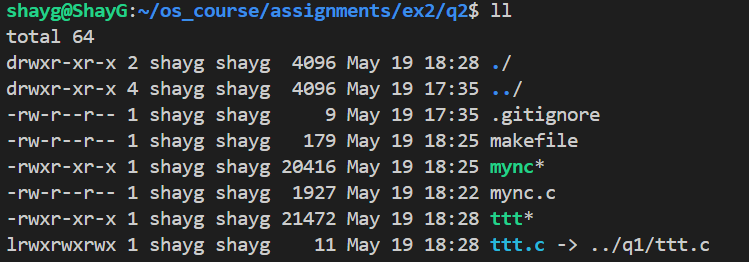

https://docs.google.com/document/d/1-0J6GD66paMZDwFDkzR8ls_3iBty5QZQ6a-bncaYfOc/edit#heading=h.t8i6gsib1baz

to make reperence to file in other folder, use the following command:

```bash
ln -s /path/to/original/file /path/to/link
```

its look like this:


we create a link to the file ttt.c file from the q1 folder to the q2 folder.

to run netcat TCP server:
```bash
nc -l -p <port>
```

to run netcat TCP client:
```bash
nc <ip> <port>
```

to run netcat UDP server:
```bash
nc -u -l -p <port>
```

to run netcat UDP client:
```bash
nc -u <ip> <port>
```
