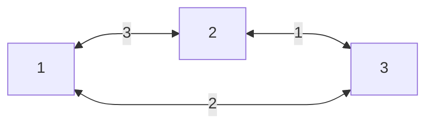

# OS Final Project

### Summary

This is the final project for the Operating Systems course.

The project instructions can be found [here](./OS%20project%20-%20MST,%20Strategy_Factory,%20Client-Server,%20Threads,%20Active%20Object,%20Thread%20poll%20(Leader-Follower)%20and%20Valgrind.pdf)

In this project, we will implemented the `Leader Follower` & `Pipeline` concurrency patterns.

We create a simple TCP select server that can handle multiple clients concurrently.

For each client, the server will store a graph object, and the client can send commands to the server to manipulate the graph, gnarate a minimum spanning tree, and make calculations on it.

### Running the server
To run the server, you can use the following command:

first compile the code using `make` command

now you have two options to run the server:

##### with Leader Follower pattern
```bash
./main -l
```

##### with Pipeline pattern
```bash
./main -p
```

To connect to the server, you can use `nc`, or any other TCP client.

```bash
nc localhost 9034
```


now you can send a commands to the server, the commands can be found [here](./client_commands.hpp)

##### Example:
```bash
nc localhost 9034
ng 3 3 1 2 3 2 3 1 3 1 2
re 2 3 1
ae 2 3 1
pg
mstp
mstk
```

in the above example, we first create a graph with 3 nodes and 3 edges, the graph will look like this:



The `mstp` command will calculate the minimum spanning tree of the graph with prim algorithm, and the `mstk` command will calculate the minimum spanning tree of the graph with kruskal algorithm.

#### Stopping the server
To stop the server, you can send the `kill` command to the server.

```bash
nc localhost 9034
kill
```


### Leader Follower pattern
The Leader Follower pattern we implemented uses a fixed number of threads to handle tasks. Each thread can act as a leader or a follower. The leader thread picks up tasks from a queue and executes them, while the follower threads wait for new tasks to be added to the queue. Once the leader takeover a task, it notifies one of the followers to become the new leader and pick up the next task. Each client command added to the queue is a task.

### Pipeline pattern
The Pipeline pattern uses the `ActiveObject` class to manage tasks in separate threads. Each `PipelineStage` object, inheriting from `ActiveObject`, represents a stage in the pipeline. 

The `ActiveObject` class encapsulates a thread and a task queue, running in a loop to pick up and execute tasks asynchronously, enhancing concurrency and performance.

The `PipelineStage` class inherits from `ActiveObject` and holds a reference to the next stage in the pipeline. Each stage processes a specific task, or part of a task, and passes the result to the next stage.

This pattern efficiently handles client commands, with each stage processing its part independently. For example, stages for adding/removing edges are single-stage tasks, while the MST calculation is a multi-stage task spanning multiple stages.

### Code Coverage

We used `gcov` to measure the code coverage of our tests.

You can run `make coverage` to run the tests and measure the code coverage.

Our outputs can be found in the [coverage_res](./coverage_res) directory.

To make the [`coverage.sh`](./coverage.sh) script work, with add a python script name [`my_client.py`](./my_client.py) that read [inputs](./inputs/) from here, line by line and send it to the server, with small breakdown between each command.

> Note: the code coverage is not 100% because there are some parts of the code that are not reachable by the tests, like some error handling code.
> 
> For some reason, the `gcov` tool does not show the coverage of the `Pipeline` class, but we are sure that it is covered by the tests.

### Valgrind

We used `valgrind` to check for memory leaks, race conditions, and profiling.

The results can be found in the [valgrind_res](./valgrind_res) directory.


### Authors
* [Shay Gali](https://github.com/ShayGali)
* [Hagay Cohen](https://github.com/hagaycohen2)
* [Chanan Helman](https://github.com/chanan-hash)